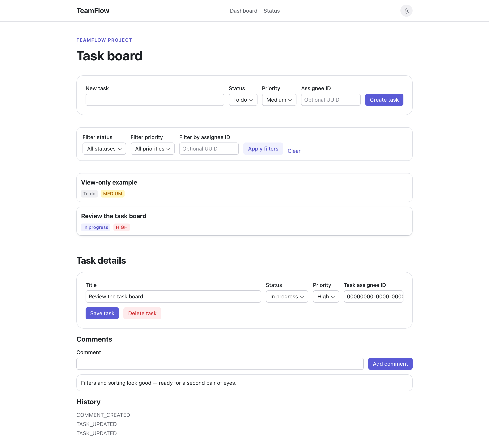
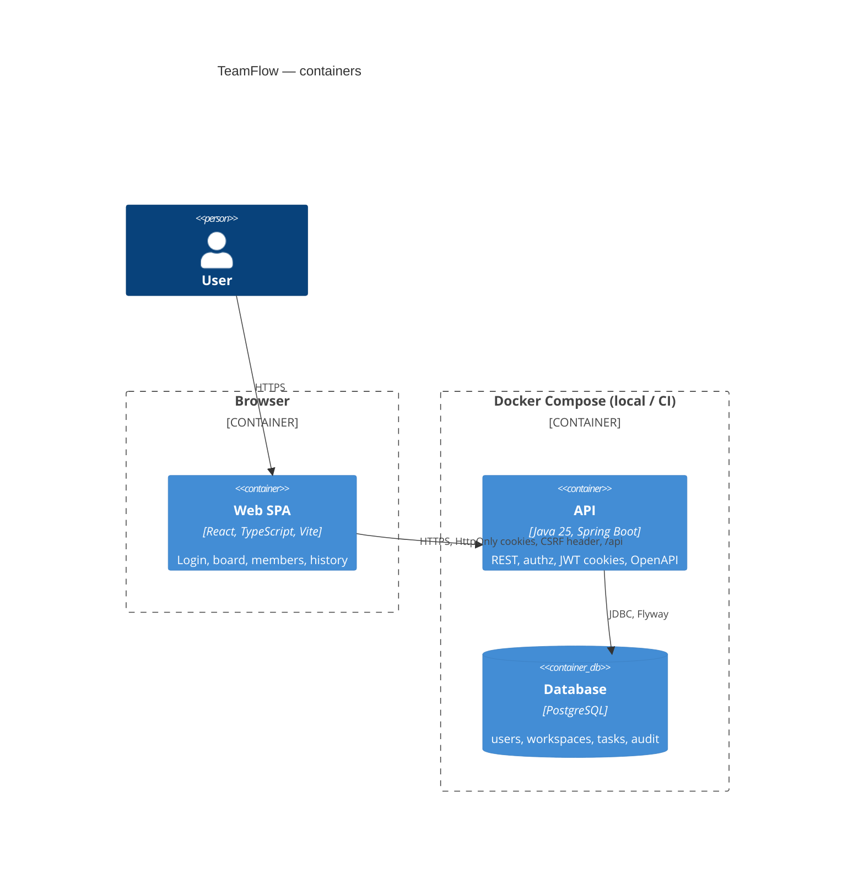

# TeamFlow

[](https://github.com/eyubin/team-flow/actions/workflows/ci.yml)
[](https://github.com/eyubin/team-flow/actions/workflows/codeql.yml)

A compact project and task management system — React SPA, Spring Boot modular monolith, PostgreSQL — built to show a complete engineering lifecycle: design, roles and authorization, optimistic locking, a real test pyramid, and a CI pipeline with security gates.



## Quick start

```bash
cp .env.example .env
make up
```

- SPA: http://localhost:3000 (proxies `/api` and `/actuator` to the API)
- API health: http://localhost:8080/actuator/health
- API docs: http://localhost:8080/swagger-ui.html
- Postgres: localhost:5432

Stop with `make down`. Demo data (below) is seeded automatically on first startup.

## Demo accounts

| Role | Email | Password |
| --- | --- | --- |
| Admin | `demo-admin@teamflow.local` | `TeamFlow-demo-123` |
| Member | `demo-member@teamflow.local` | `TeamFlow-demo-123` |
| Viewer | `demo-viewer@teamflow.local` | `TeamFlow-demo-123` |

Sign in at http://localhost:3000/auth, then open **Demo Workspace → Demo Project** to see the seeded task board. The viewer account is a ready-made way to see role denial in action: it can open the board but any write attempt is rejected server-side.

## Features

- Register, sign in, sign out with HttpOnly-cookie JWT sessions
- Workspaces and projects, with `ADMIN` / `MEMBER` / `VIEWER` roles enforced on the backend, not just the UI
- Task CRUD with status, priority, assignee, and server-side pagination, filtering, and sorting
- Comments and a full audit history per task
- Optimistic locking: a stale update is rejected with a `409` and a clear "reload and retry" UI, instead of silently overwriting someone else's change
- Consistent RFC 7807 Problem Details error responses across the API
- Dedicated loading, empty, validation, forbidden (403), and conflict (409) UI states — not just a generic error string
- Seeded demo accounts and data for a zero-setup walkthrough

## Architecture

TeamFlow is a **modular monolith**: one Spring Boot process, one PostgreSQL database, one React SPA — a deliberate choice over microservices at this scale (see [ADR 0001](docs/adr/0001-modular-monolith.md)).



The backend is organized by business capability (`auth`, `workspace`, `task`, `audit`, `shared`), not by technical layer — see the full context, container, and module diagrams in [docs/diagrams/c4.md](docs/diagrams/c4.md), and the data model in [docs/diagrams/er.md](docs/diagrams/er.md). API DTOs never expose JPA entities directly.

## Technology choices

| Layer | Stack | Why |
| --- | --- | --- |
| Frontend | React 19, TypeScript, Vite, React Router, TanStack Query, React Hook Form + Zod | Server state and caching handled by Query instead of hand-rolled `useState`/`fetch`; forms get schema-validated, typed submission with inline error messages instead of relying on native HTML validation |
| Frontend tests | Vitest, React Testing Library, Playwright | Component tests close to the code, E2E against the real Compose stack (no mocking) |
| Backend | Java 25, Spring Boot 4, Spring Security, Spring Data JPA | Mainstream, well-documented, matches what most teams actually run |
| Database | PostgreSQL 16, Flyway | Real constraints and indexes in CI via Testcontainers, not H2 |
| Auth | Short-lived JWT in HttpOnly cookies + double-submit CSRF | Stateless API, no server-side session store; rationale in [ADR 0002](docs/adr/0002-cookie-jwt-auth.md) |
| API docs | springdoc-openapi | Live spec generated from the real controllers, checked in CI, not a hand-maintained doc that drifts |
| Infra | Docker multi-stage builds, non-root users, Compose | One-command local stack; images are as close to production shape as this scale warrants |
| CI/CD | GitHub Actions: CodeQL, Dependabot, Gitleaks, Trivy | Security gates a portfolio project doesn't usually bother with, on purpose |

## Test commands

```bash
make test          # backend (Testcontainers) + frontend lint/typecheck/unit/build
make backend-test   # Spring Boot tests only
make frontend-test  # frontend lint/typecheck/unit/build only
make e2e            # Playwright E2E against a live Compose stack
```

Backend tests require Docker (Testcontainers PostgreSQL). `make e2e` builds and tears down its own Compose stack, so it's independent of `make up`.

## API documentation

- Live, always-current spec: http://localhost:8080/v3/api-docs (JSON) and http://localhost:8080/swagger-ui.html (interactive UI) once the stack is running
- Hand-written outline for browsing without running anything: [docs/openapi.yaml](docs/openapi.yaml)
- CI asserts the live spec actually contains the core routes on every build, so the two can't silently drift apart

Endpoint groups: `/api/auth`, `/api/workspaces` (+ members, + projects), `/api/projects/{id}`, `/api/projects/{id}/tasks`, `/api/tasks/{id}` (+ comments), `/api/audit-events`, `/actuator/health`.

## Security

- Passwords hashed with Argon2; JWTs are short-lived (15 min access / 7 day refresh) and live only in HttpOnly, SameSite=Lax cookies — never in `localStorage`
- CSRF protection via double-submit cookie on every mutating request
- Strict CORS allowlist, RFC 7807 error responses with no stack traces leaked to clients
- Resource-level authorization enforced server-side (`TaskService`, `WorkspaceService`), independent of what the UI happens to render
- Automated in CI: [CodeQL](.github/workflows/codeql.yml) (SAST), [Dependabot](.github/dependabot.yml) (SCA for Maven/npm/Docker/Actions), [Gitleaks](.github/workflows/ci.yml) (secret scanning), [Trivy](.github/workflows/ci.yml) (container image scanning, SARIF uploaded to the Security tab)

## CI/CD

Every PR runs, via [`ci.yml`](.github/workflows/ci.yml): frontend lint/typecheck/unit/build, backend unit + integration tests (real Postgres via Testcontainers), a Compose smoke test with health checks, an OpenAPI contract check, the full Playwright E2E suite against the live stack, secret scanning, and container image scanning. [`codeql.yml`](.github/workflows/codeql.yml) runs SAST on push, PR, and weekly.

There's no release/CD workflow yet — see Roadmap. Per the project's own convention, that workflow will be named `release`, not `CD`, until an actual deployment target exists.

## Trade-offs and roadmap

Deliberately out of scope for this MVP: microservices, Kubernetes, a custom OAuth server, real-time features, login rate limiting. A modular monolith and a modest feature set are more valuable in a portfolio than several artificial services.

What's genuinely still missing, in rough priority order:

1. **GHCR release images and a staging deployment** — no public hosting target is selected yet, so there's no `release` workflow (publishing images with no target to deploy them to isn't real continuous delivery).
2. **Login rate limiting** — explicitly deferred past the MVP per the project's own security checklist.

One deliberate non-goal worth naming: `frontend/.trivyignore` currently suppresses 9 nginx CVEs in the base image whose fix Trivy's advisory data cites but Alpine hasn't published yet. Dependabot watches that Dockerfile, so the ignore entries should become removable, not permanent.

## ADRs

- [0001 — Modular monolith](docs/adr/0001-modular-monolith.md)
- [0002 — Cookie-based JWT authentication](docs/adr/0002-cookie-jwt-auth.md)
- [0003 — Optimistic locking for tasks](docs/adr/0003-optimistic-locking.md)

Also in [`docs/`](docs/): [user stories and acceptance criteria](docs/user-stories.md), [C4 and module diagrams](docs/diagrams/c4.md), [ER diagram](docs/diagrams/er.md), [OpenAPI outline](docs/openapi.yaml).

## Layout

```
frontend/   Vite + React, Vitest/RTL unit tests, Playwright E2E (e2e/)
backend/    Spring Boot 4, Java 25, Flyway, JUnit 5 + Testcontainers
infra/      Docker Compose
docs/       ADRs, diagrams, user stories, OpenAPI outline
```
