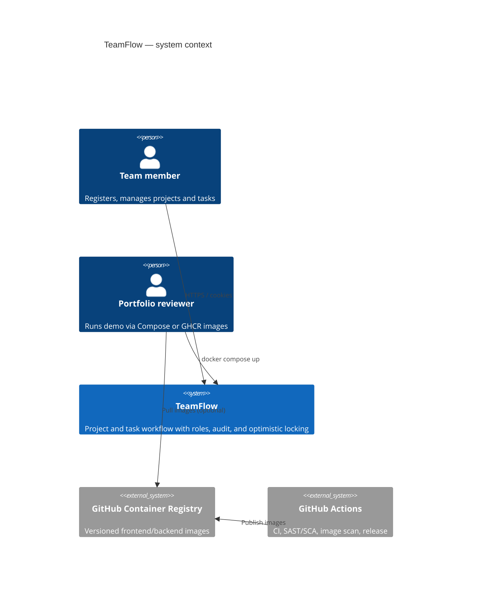
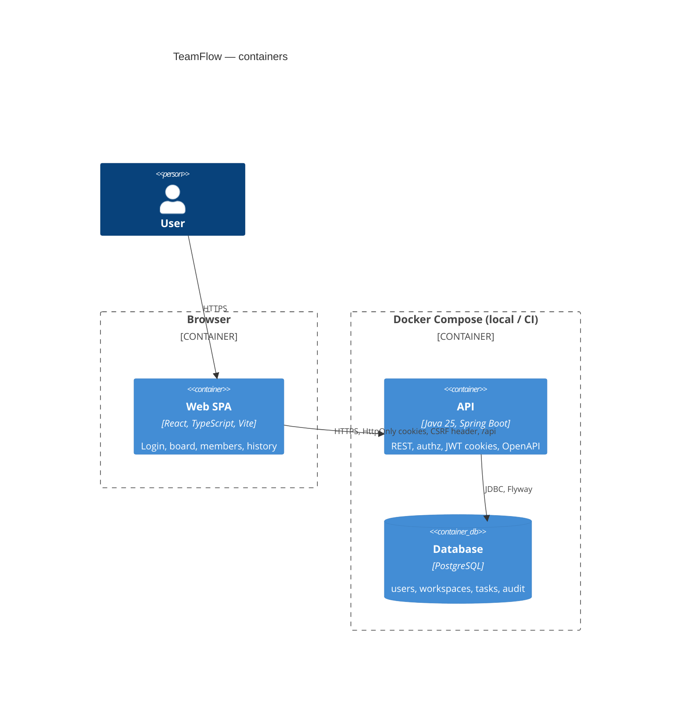
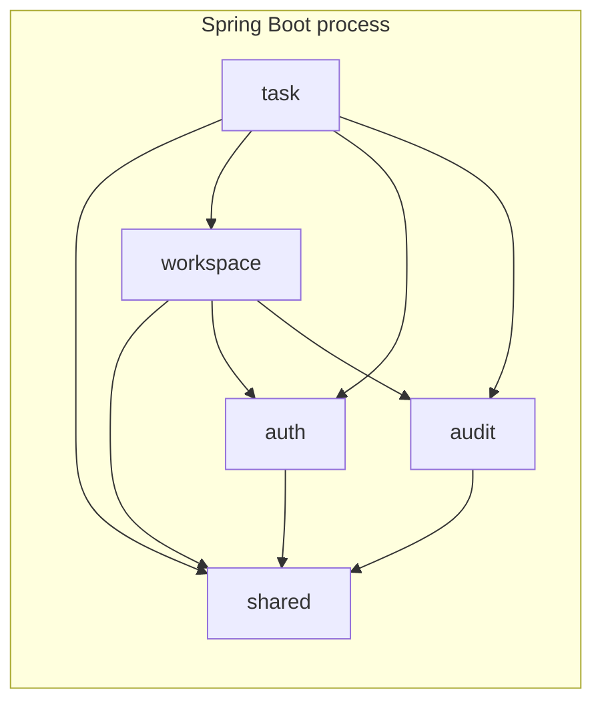

# C4-style diagrams

TeamFlow is a **modular monolith**: one Spring Boot process, one PostgreSQL database, one React SPA. Modules are package boundaries, not separately deployed services.

## Level 1 — Context

## Level 2 — Container

Browser never talks to PostgreSQL. JWT payload is not stored in `localStorage`.

## Modular monolith (inside the API)

| Module      | Owns                                      |
| ----------- | ----------------------------------------- |
| `auth`      | Users, register/login/refresh/logout, `/me`   |
| `workspace` | Workspaces, members, projects, role checks |
| `task`      | Tasks, comments, list filters              |
| `audit`     | `audit_events` write/query                 |
| `shared`    | Security config, Problem Details, pagination |

Persistence and HTTP DTOs stay inside the owning module. Other modules depend on application services or small published ports, not on JPA entities.
