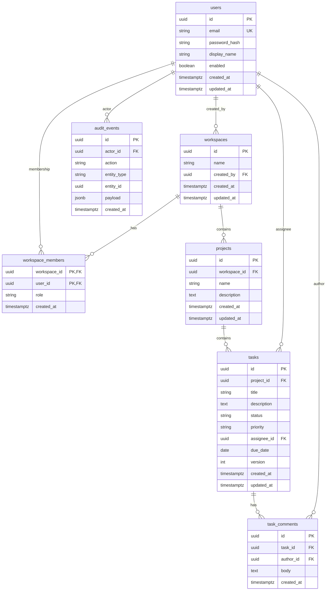

# Entity-relationship diagram

Logical model for MVP. Physical types (UUID vs BIGINT) are an implementation detail; **UUIDs** are the default for public IDs.

## Constraints and indexes

- `users.email` unique, stored lowercase.
- `workspace_members` primary key `(workspace_id, user_id)`; `role` in `ADMIN`, `MEMBER`, `VIEWER`.
- `tasks.status` in `TODO`, `IN_PROGRESS`, `DONE`.
- `tasks.priority` in `LOW`, `MEDIUM`, `HIGH`.
- `tasks.version` starts at `0` and is incremented by JPA optimistic locking.
- `tasks.assignee_id` nullable; if set, assignee must be a member of the task’s workspace (enforced in application layer).

Indexes aligned with list/filter queries (see [ADR 0003](../adr/0003-optimistic-locking.md) for concurrency; indexes justified here):

| Index                                         | Query                                      |
| --------------------------------------------- | ------------------------------------------ |
| `tasks (project_id, created_at DESC)`         | Default board/list                         |
| `tasks (project_id, status)`                  | Filter by status                           |
| `tasks (project_id, assignee_id)`             | Filter by assignee                         |
| `tasks (project_id, priority)`                | Filter by priority                         |
| `audit_events (entity_type, entity_id, created_at DESC)` | History for a task/project     |
| `workspace_members (user_id)`                 | “My workspaces” lookup                     |
